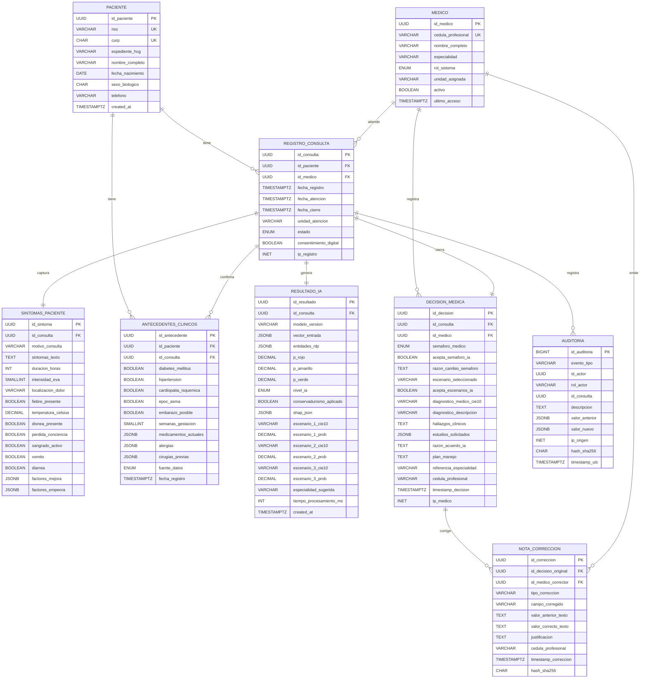

# SMART X — Diagramas Mermaid.js
## Hospital Civil Viejo de Guadalajara | Febrero 2026

---

## DIAGRAMA 1 — Entidad-Relación (ER)

> Pegar en: [mermaid.live](https://mermaid.live) | Notion | GitHub README | Draw.io (import)



---

## DIAGRAMA 2 — Flowchart del Sistema (paciente → IA → médico)

> Mismo enlace: [mermaid.live](https://mermaid.live) — seleccionar tema: `default` o `base`

```mermaid
flowchart TD
    %% ── ESTILOS ──────────────────────────────────────────────
    classDef paciente  fill:#2E75B6,stroke:#1F4E79,color:#fff,rx:8
    classDef sistema   fill:#006064,stroke:#004D40,color:#fff,rx:4
    classDef modelo    fill:#4A148C,stroke:#311B92,color:#fff,rx:4
    classDef medico    fill:#375623,stroke:#1B5E20,color:#fff,rx:8
    classDef decision  fill:#F9A825,stroke:#E65100,color:#1A1A1A,rx:0
    classDef rojo      fill:#C00000,stroke:#7F0000,color:#fff,rx:8
    classDef amarillo  fill:#F9A825,stroke:#E65100,color:#1A1A1A,rx:8
    classDef verde     fill:#375623,stroke:#1B5E20,color:#fff,rx:8
    classDef audit     fill:#FCE4D6,stroke:#C00000,color:#C00000,rx:4
    classDef fin       fill:#1F4E79,stroke:#0D2B4E,color:#fff,rx:12

    %% ══════════════════════════════════════════════════════════
    %% FASE 1 — ENTRADA DEL PACIENTE
    %% ══════════════════════════════════════════════════════════
    START([" 👤 Paciente llega al HCG "]):::paciente

    START --> AUTH["Autenticación\nNSS / CURP"]:::paciente
    AUTH --> AUTHOK{¿Autenticado?}:::decision
    AUTHOK -- NO --> ERR["Error — máx. 3 intentos\n→ Escalar a personal"]:::rojo
    AUTHOK -- SÍ --> MOTIVO["Selección motivo de consulta\n🤒 Dolor  🌡 Fiebre  🩹 Lesión\n💊 Crónico  😟 Malestar"]:::paciente

    MOTIVO --> EMERG{¿Síntoma\nde alarma?}:::decision
    EMERG -- SÍ 🚨 --> ALERT["⚠️ ALERTA INMEDIATA\nal personal de enfermería\nFlujo interrumpido"]:::rojo
    EMERG -- NO --> FORM["Formulario guiado condicional\n• Descripción libre de síntomas\n• Intensidad EVA 0–10\n• Duración y localización\n• Factores mejora/empeora"]:::paciente

    FORM --> ANTEC["Confirmación de antecedentes\nDM · HTA · Cardiopatía · Alergias\n(precargados del expediente HCG)"]:::paciente
    ANTEC --> CONSENT["Consentimiento informado\ndigital — LFPDPPP"]:::paciente
    CONSENT --> SEND["📤 Envío cifrado TLS 1.3\nal API Gateway"]:::paciente

    %% ══════════════════════════════════════════════════════════
    %% FASE 2 — PROCESAMIENTO BACKEND / IA
    %% ══════════════════════════════════════════════════════════
    SEND --> GATEWAY["🔒 API Gateway — FastAPI\nValidación token · Log auditoría"]:::sistema
    GATEWAY --> VALID{¿Paquete\nválido?}:::decision
    VALID -- NO --> REJECT["Rechazo 400\nLog de error"]:::rojo
    VALID -- SÍ --> NLP["🧠 Pipeline NLP\nspaCy + BioBERT-es\nExtracción entidades clínicas"]:::modelo

    NLP --> VEC["📐 Vectorización\nOne-Hot Encoding\nImputación por mediana"]:::modelo
    VEC --> XGB["⚡ Modelo XGBoost\nClasificación semáforo\np_rojo · p_amarillo · p_verde"]:::modelo

    XGB --> CONS{¿Diferencia\np_rojo−p_amarillo\n< 0.10?}:::decision
    CONS -- SÍ ⚠️ --> CONSERV["Conservadurismo médico\n→ Subir a nivel ROJO\npor seguridad clínica"]:::rojo
    CONS -- NO --> NIVEL["Asignar nivel de\nmayor probabilidad"]:::modelo

    CONSERV --> SHAP
    NIVEL --> SHAP["🔍 Módulo SHAP\nExplicación en español\npara el médico"]:::modelo

    %% ══════════════════════════════════════════════════════════
    %% FASE 3 — OUTPUT DEL MODELO
    %% ══════════════════════════════════════════════════════════
    SHAP --> ESC["📋 Clasificador diferencial\n3 escenarios CIE-10\ncon probabilidad"]:::modelo
    ESC --> HL7["📄 Historial clínico\nHL7-FHIR R4\n(NOM-004-SSA3)"]:::sistema
    HL7 --> PACK["📦 Empaquetado\n+ Firma digital SHA-256\n→ Panel médico"]:::sistema

    %% ══════════════════════════════════════════════════════════
    %% FASE 4 — PANEL MÉDICO
    %% ══════════════════════════════════════════════════════════
    PACK --> COLA["🩺 Cola de pacientes\nordenada por semáforo"]:::medico

    COLA --> SEMRESULT{Nivel\nasignado}:::decision
    SEMRESULT -- ROJO --> R["🔴 ROJO — URGENTE\n< 15 min"]:::rojo
    SEMRESULT -- AMARILLO --> A["🟡 AMARILLO — PRIORITARIO\n< 30 min"]:::amarillo
    SEMRESULT -- VERDE --> V["🟢 VERDE — NO URGENTE\n< 60 min"]:::verde

    R --> MEDREV["Médico revisa historial\n+ 3 escenarios IA\n+ razón SHAP"]:::medico
    A --> MEDREV
    V --> MEDREV

    MEDREV --> DECMED{¿Confirma\nclasificación IA?}:::decision
    DECMED -- NO --> MODSEM["Modifica semáforo\n+ justificación extendida\nobligatoria"]:::medico
    DECMED -- SÍ --> JUST

    MODSEM --> JUST["📝 Justificación clínica\nHallazgos · CIE-10\nPlan · Cédula profesional"]:::medico
    JUST --> CEDOK{¿Cédula\nválida?}:::decision
    CEDOK -- NO --> BLOCK["Sistema bloquea cierre\nCampos faltantes marcados"]:::rojo
    CEDOK -- SÍ --> CLOSE["✅ Cierre del expediente\nTimestamp UTC · Hash SHA-256\nRegistro inmutable"]:::medico

    %% ══════════════════════════════════════════════════════════
    %% FASE 5 — RETROALIMENTACIÓN
    %% ══════════════════════════════════════════════════════════
    CLOSE --> FEED["Motor de retroalimentación\n¿Desacuerdo médico–IA?"]:::sistema
    FEED --> DRIFT{¿Tasa\ndesacuerdo\n> 15%?}:::decision
    DRIFT -- SÍ --> RETRAIN["Reentrenamiento\ncontrolado + validación\nclínica (MLflow)"]:::modelo
    DRIFT -- NO --> OK["Operación normal\nhasta próxima evaluación\nmensual"]:::verde

    CLOSE --> AUDITLOG[("🗄 Log de auditoría\nInmutable · WORM\nSHA-256 por fila")]:::audit
    RETRAIN --> FIN(["Sistema actualizado\nVersionado en MLflow"]):::fin
    OK --> FIN
```



---

## Notas de uso

| Plataforma | Cómo renderizar |
|---|---|
| **mermaid.live** | Pegar el bloque de código directamente |
| **GitHub README** | Bloque de código con ` ```mermaid ` |
| **Notion** | Bloque `/code` → seleccionar Mermaid |
| **VS Code** | Extensión "Markdown Preview Mermaid Support" |
| **Draw.io** | Extras → Edit Diagram → pegar XML o usar plugin Mermaid |

> **Tip para presentación:** El Flowchart tiene 5 zonas de color.
> Azul = acciones del paciente · Teal/Morado = sistema/IA · Verde oscuro = médico · Rojo = alertas y errores · Amarillo = decisiones.
